# Two player board game
* Design an AI program to play a two-player nXn board game with human player or the other AI program.
* Use **MCTS(monte carlo tree search)** to find the best next move of AI program.

## Description
### Introduction
Take a 4X4 board for example:

  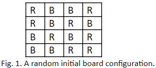

Each tile is colored in Red (denoted by R) or Blue (denoted by B), and the numbers of the color tiles are even, e.g. 8 Red and 8 Blue on a 4X4 board.

You can choose R or B first, and then you can choose to make the 1st move or the next.
Each single move involves the removal of a colored tile of the choice. For example, given the initial board configuration above, assuming your color is R, and you’ll make the 1st 
move, one possible legal move will be removing the R on the upper left corner. The new board configuration is shown below after you remove that R.

  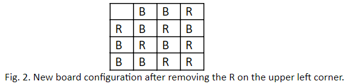

This is a two-player game that takes alternating turns. After your move, it is the AI program’s turn to make its move, e.g. removing the B on the low left corner. Now the new board 
configuration becomes

  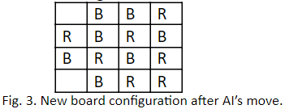

The one that removes all the colored tiles of the choice first is the winner. In this example, if you remove all the R’s before the AI removes all the B’s, you win.
At this point, the game may look naïve because whoever makes the 1st move is guaranteed to win. Nevertheless, there are other rules of the game, as detailed below, that make this 
game a bit more complicated.

### Rules
1. The removal of a tile will cause side effects that apply ONLY to its “direct” neighbors regardless of their colors.
E.g. the removal of the R will affect its direct neighbors right above, right below, to its left, and to its right (as indicated by the four question marks).

  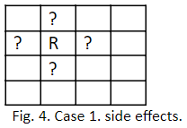
  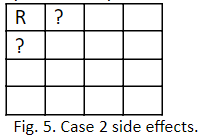
  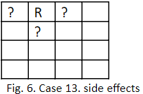

2. The side effects can cause the automatic removals of these direct neighbors under certain conditions. 
Each tile (as a square) has 4 sides. After a tile is removed, you need to check its direct neighbors. Depending on its location on the board, it can have at most 
4 direct neighbors (note. the colors of neighbors do not matter). For each of these neighbors, unless it has three or four sides connected to other tiles or to the 
wall (side) of the board, it will be removed automatically.

  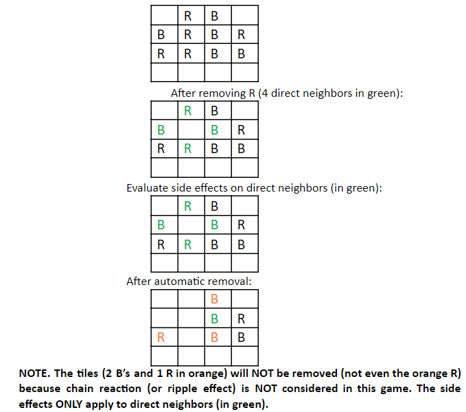

## Build the AI program
In order to find the next move of the AI program, we used **MCTS(monte carlo tree search)** as the search strategy.

### What is MCTS
This algorithm is used specially in games to find the best next move from any given game state of any game. Alpha Go reportedly used this algorithm with a combination of Neural Network. 

MCTS is a way of searching a tree. Within this tree, its nodes represent the **states** and the arc between nodes represents the **choice** that would take from one state to the other. 

The algorithm consists of 4 phases:

FIG

This 4-phase algorithm is run repeatedly until enough information is gathered to produce a good move.

**1. Selection**

Existing information is used to repeatedly choose successive child nodes down to the end of the search tree. Our path selection should achieve two goals: 
* We should explore new paths to gain information
* We should use existing information to exploit paths known to be good. 
In order to help us achieve these two goals, we need to select child nodes using a selection function that balances *exploration* and *exploitation*.

UCB function (Upper Confidence Bound 1) is used to decide which nodes to select.

FIG

- **wᵢ** : this node’s number of simulations that resulted in a win -> can also be treat as the **reward** of wining the game. Users can design different reward function based on their projects' requirement.

- **sᵢ** : this node’s total number of simulations
- **s**  : parent node’s total number of simulations
- **c**  : exploration parameter

* The left term (wᵢ / sᵢ) is the exploitation term -> average win rate.
* The right term (sqrt(ln s / sᵢ)) is the exploration term -> It goes larger the less frequently a node is selected for simulation.
* c is the exploration rate

**2. Expansion**

When the selection phase reach a leaf node, the search tree is expanded by adding a node. we randomly create one unexpanded move and add this node as a child to the last selected node in the selection phase. The statistics information in the node is initialized with 0 wins out of 0 simulations (wᵢ = 0, sᵢ = 0).

**3. Simulation**

A simulation is run to the end to determine the winner. Continuing from the newly-created node in the expansion phase, moves are selected randomly and the game state is repeatedly advanced. This repeats until the game is finished and a winner emerges.

**4.Backpropagation**

Finally, the simulation counts of all nodes in the selected path are updated with new information gained from the simulated game.

### Applying MCTS in this game
In this project, the **board** represent the state and each **tile** represents the choice that AI program would take.

The search procedure consists of 3 phases, **Tree policy,Default policy,and Backpropagation**

**1. Tree policy (Selection + Expansion)**

In this phase, we are going select a target node to conduct the simulation. If the current node didn't have any child node, we will randomly create one unexpanded move and treat this child node as the target node. Otherwise, if the current node already has child nodes, it has a half chance to expand a new child node or use the UCB function to determine the target node.

**2. Default policy (Simulation)**

Randomly choose the legal move until the simulation reach the stop conditions, which are the end of the game (one of the player has removed all his/her own tiles) or tie (two players removed all their tiles at the same time, due to the side effect). The reward of each results will be calculated at this phase:
* Win : reward = 3
* Lose : reward = -3
* Tie : reward = -2
A legal move means the player select his/her own tile to remove. For example, if the player's tile color is Red, it is illegal for him to select a Blue color tile to remove.

**3. Backpropagation** 

Update the simulation counts and reward information of all nodes in the selected path.

Repeat the above mentioned procedure with `k iterations (k=1000)`, the AI program will choose a best tile to be removed based on the UCB function.  

*Note: adjust variable `k` in `AILoop()` function can change the number of iteration of the MCTS algorithm.*

*Note: change the `fileName` to change initial board*

## Play the game with AI program
**Step 1**

Run the `final_project.py`, you will see a initial board with the color of each tile and the number of rows and columns.

  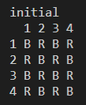

**Step 2**

Users can choose if they want to go first or not, and they have to select a color.
Enter the number of row and column to remove the tile, the console will first show the board after users remove the specific tile and then show the board after the side effect.

  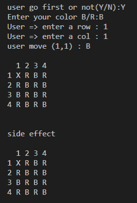

**Step 3**

The AI program will decide it's action right after the user turn. The console will also show two boards, the first is the current board after the AI remove the tile, and the second board is the result of the side effect.

  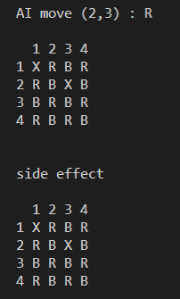

**Step 4**

Users can choose their next step to remove the tile. Repeat the above steps, which is, the AI program and the user take turns to remove the tile, until the end of the game

  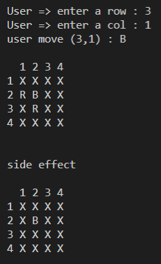

**Reference**

* [AI: Monte Carlo Tree Search (MCTS)](https://medium.com/@pedrohbtp/ai-monte-carlo-tree-search-mcts-49607046b204) 
* [General Game-Playing With Monte Carlo Tree Search](https://medium.com/@quasimik/monte-carlo-tree-search-applied-to-letterpress-34f41c86e238)
